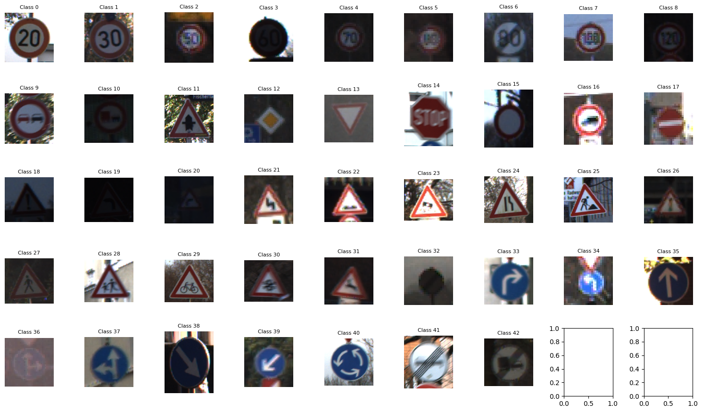

# Traffic-Sign-Classification-using-Computer-Vision

## 📝 Problem Statement
The goal of this project is to **classify German traffic signs** into their correct categories using deep learning models.  
Traffic sign recognition is a critical component of **autonomous driving systems** and advanced driver-assistance systems (ADAS), where real-time classification must be robust against lighting variations, rotations, occlusions, and class imbalance.

---

## 📊 Data Source
- **Dataset:** [German Traffic Sign Recognition Benchmark (GTSRB)](https://benchmark.ini.rub.de/gtsrb_news.html)  
- **Access:** Available directly via `torchvision.datasets.GTSRB`  
- **Content:** 43 different traffic sign classes with thousands of labeled images  
- **Structure:** Training, validation, and test splits with a stratified distribution  

Example samples from the dataset:  

---

## 🔄 Preprocessing
To prepare and balance the dataset for training:  
- **Image Processing:**  
  - Resize to `64×64` pixels  
  - Convert to tensors (`ToTensor`)  
  - Normalize pixel values  
- **Data Augmentation:**  
  - Random rotations (`RandomRotation`)  
  - Affine transformations (`RandomAffine`)  
  - Color jitter (`ColorJitter`)  
- **Class Imbalance Handling:**  
  - Stratified splits and **balanced sampling** ensured minority classes were not underrepresented.  

---

## 🏗️ Models Used
Three architectures were implemented and compared:  

1. **Custom MLP Classifier**  
   - Fully connected layers (flattened input)  
   - Dropout and BatchNorm1d for regularization  
   - Serves as a baseline  

2. **Custom CNN Classifier**  
   - Multiple convolutional layers with ReLU, BatchNorm2d, and MaxPooling  
   - Stronger regularization and capacity to capture spatial features  
   - Designed specifically for 64×64 traffic sign images  

3. **ResNet-50 (Transfer Learning)**  
   - Pretrained on ImageNet via `torchvision.models.resnet50`  
   - Final layer replaced for 43 GTSRB classes  
   - Partial fine-tuning (only last block unfrozen)  

---

## ✅ Results

| Metric              | CNN    | MLP    | ResNet-50 |
|----------------------|:------:|:------:|:---------:|
| Accuracy             | **98.84** | 65.84 | 96.97 |
| Precision (Macro)    | **98.32** | 64.90 | 95.14 |
| Recall (Macro)       | **97.99** | 65.22 | 96.71 |
| F1 (Macro)           | **97.98** | 63.50 | 95.79 |
| Precision (Micro)    | **98.84** | 65.84 | 96.97 |
| Recall (Micro)       | **98.84** | 65.84 | 96.97 |
| F1 (Micro)           | **98.84** | 65.84 | 96.97 |

### 📌 Discussion
- **Best Model:** The **custom CNN** achieved the highest accuracy (98.84%), slightly outperforming ResNet-50 (96.97%).  
- **MLP Baseline:** The MLP lagged far behind (65.84%) since it flattened images and ignored spatial patterns.  
- **Macro vs. Micro:** Near-equal macro and micro scores for CNN/ResNet-50 indicate **balanced performance across all classes**, thanks to stratified splits, augmentation, and balanced sampling.  
- **CNN vs. ResNet-50:** Despite transfer learning, the CNN slightly outperformed ResNet-50, likely due to:  
  1. Partial fine-tuning of ResNet-50  
  2. Domain gap between ImageNet and GTSRB  
  3. CNN being compact and tailored to 64×64 inputs with stronger regularization  

---

## 🚀 Conclusion
- **Custom CNN** proved to be the most effective, achieving nearly **99% accuracy**, surpassing ResNet-50.  
- Balanced sampling and targeted augmentation were key in mitigating class imbalance.  
- The MLP baseline was useful for comparison but inadequate for fine-grained visual recognition tasks.  
- Future work:  
  - Fully fine-tune ResNet-50 with more training epochs  
  - Explore more advanced architectures like EfficientNet or Vision Transformers  

